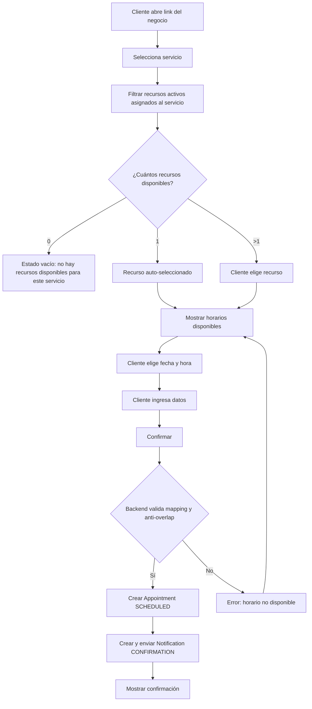

# Flujos principales (MVP)

## Flujo 1 — Onboarding del negocio

**Admin**

1. Registrarse/Login (Supabase Auth)
2. Crear negocio (nombre, timezone, resource_label)
3. El dashboard muestra un checklist inicial:
    - recursos
    - servicios
    - **asignar servicios ↔ recursos**
    - disponibilidad
4. Completar el checklist

**Resultado:** negocio listo para publicar turnos.

---

## Flujo 2 — Crear recursos

**Admin**

1. Ir a “Recursos”
2. Crear recurso (nombre, tipo opcional, estado ACTIVE)
3. Repetir según necesidad (Cancha 1, Cancha 2 / Peluquero 1, etc.)

**Resultado:** recursos creados  
(aún no necesariamente “ofrecibles” hasta asignarlos a servicios).

---

## Flujo 3 — Crear servicios

**Admin**

1. Ir a “Servicios”
2. Crear servicio definiendo:
    - duración del turno
    - periodicidad de turnos (por defecto igual a la duración)
    - precio opcional
3. Guardar servicio

Si el servicio está `ACTIVE`, queda visible en la página pública  
(aunque solo será reservable si tiene recursos asignados).

**Resultado:** servicios listos para ser ofrecidos.

---

## Flujo 4 — Asignar servicios a recursos (Service ↔ Resource)

**Admin**

1. Ir a “Servicios”
2. Abrir un servicio → sección “Recursos” (o “Asignación”)
3. Seleccionar qué recursos ofrecen ese servicio  
   (solo recursos en estado `ACTIVE`)
4. Guardar cambios

**Resultado:** el servicio queda **reservable** con los recursos seleccionados.

> Regla:  
> Un servicio `ACTIVE` sin recursos asignados no debe permitir reservas  
> (estado vacío en público o mensaje “no hay recursos disponibles para este servicio”).

---

## Flujo 5 — Definir disponibilidad semanal por recurso

**Admin**

1. Entrar a un recurso → “Disponibilidad”
2. Elegir día de la semana
3. Agregar uno o más rangos horarios (inicio / fin)
4. Guardar

**Resultado:** el sistema puede calcular horarios disponibles para ese recurso.

---

## Flujo 6 — Reserva de turno (cliente)

**Cliente**

1. Abrir el link público `/b/{slug}`
2. Ver la lista de servicios `ACTIVE`
3. Elegir un servicio
4. Elegir recurso (si aplica), **filtrado por recursos `ACTIVE` asignados al servicio**
    - Si hay 1 recurso asignado y activo: se omite el paso (auto-selección)
    - Si hay más de uno: se muestra el listado usando `resource_label`
5. Ver horarios disponibles para el par `(service, resource)`:
    - dentro de la disponibilidad semanal del recurso
    - excluyendo bloqueos puntuales del recurso
    - excluyendo turnos ya existentes
    - respetando la duración y la **periodicidad de turnos** del servicio
6. Elegir fecha y hora
7. Completar datos (nombre + email o teléfono)
8. Confirmar reserva

**Sistema**

-   Valida que `service` esté `ACTIVE`
-   Valida que `resource` esté `ACTIVE`
-   Valida la relación Service ↔ Resource
-   Crea o reutiliza el cliente (`customer`)
-   Crea un `appointment` en estado `SCHEDULED`:
    -   `end_at = start_at + duración`
    -   `occupied_end_at = start_at + periodicidad`
-   La base de datos rechaza solapamientos (anti double-booking)
-   Crea la notificación de confirmación y envía el email

**Resultado:** turno confirmado sin doble reserva.

---

## Flujo 7 — Ver agenda (negocio)

**Admin / Staff**

1. Entrar a “Agenda”
2. Elegir día (por defecto: hoy)
3. Filtrar por recurso o “Todos”
4. Ver lista de turnos ordenada por hora, con estado y detalles

**Resultado:** operación diaria organizada y clara.

---

## Flujo 8 — Cancelar turno

**Admin / Staff**

1. Abrir un turno en estado `SCHEDULED`
2. Cancelar (motivo opcional)

**Sistema**

-   Actualiza el estado a `CANCELLED`
-   Envía email de cancelación
-   El horario vuelve a estar disponible

**Resultado:** turno cancelado y cliente notificado.

---

## Flujo 9 — Reprogramar turno

**Admin / Staff**

1. Abrir un turno en estado `SCHEDULED`
2. Reprogramar → elegir un nuevo horario válido

**Sistema**

-   Crea un nuevo turno o actualiza el existente  
    (recomendado: crear uno nuevo con `rescheduled_from_id`)
-   La DB impide solapamientos en el nuevo horario
-   Envía email con el nuevo horario

**Resultado:** turno reprogramado con trazabilidad.

---

## Flujo 10 — Bloqueo puntual (excepción)

**Admin**

1. Entrar a un recurso → “Bloqueos”
2. Crear bloqueo (inicio / fin)

**Sistema**

-   Evita ofrecer horarios dentro de ese rango

**Resultado:** feriados, licencias o mantenimiento cubiertos.

---

## Flujo 11 — Recordatorios automáticos (job)

**Sistema**

1. Un job corre cada X minutos
2. Busca turnos `SCHEDULED` próximos según los offsets del negocio (24h / 2h)
3. Crea notificaciones `PENDING` si no existían (idempotencia)
4. Envía emails y marca `SENT` o `FAILED`

**Resultado:** recordatorios enviados sin duplicados.

---

## Diagrama (Mermaid) — Reserva de turno

