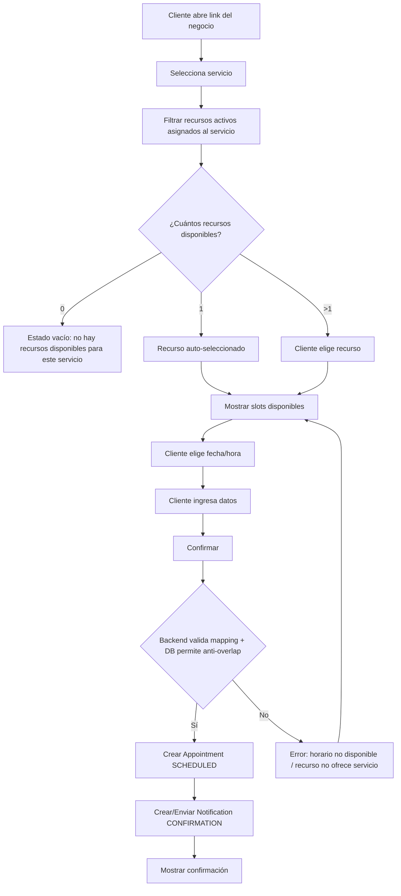

# Flujos principales (MVP)

## Flujo 1 — Onboarding del negocio

**Admin**

1. Registrarse/Login (Supabase Auth)
2. Crear negocio (nombre, timezone, resource_label)
3. Dashboard muestra checklist:
    - recursos
    - servicios
    - **asignar servicios ↔ recursos**
    - disponibilidad
      **Resultado:** negocio listo para publicar turnos.

---

## Flujo 2 — Crear recursos

**Admin**

1. Ir a “Recursos”
2. Crear recurso (nombre, tipo opcional, estado ACTIVE)
3. Repetir (Cancha 1, Cancha 2 / Peluquero 1, etc.)
   **Resultado:** recursos creados (aún no necesariamente “ofrecibles” hasta asignarlos a servicios).

---

## Flujo 3 — Crear servicios

**Admin**

1. Ir a “Servicios”
2. Crear servicio (duración, buffer opcional, precio opcional)
3. Servicio queda visible en página pública si está ACTIVE
   **Resultado:** servicios listos para ser ofrecidos (requieren asignación a recursos).

---

## Flujo 4 — Asignar servicios a recursos (Service ↔ Resource)

**Admin**

1. Ir a “Servicios”
2. Abrir un servicio → “Recursos” (o “Asignación”)
3. Seleccionar qué recursos ofrecen ese servicio (solo recursos ACTIVE)
4. Guardar
   **Resultado:** el servicio queda **reservable** con los recursos seleccionados.

> Regla: un servicio ACTIVE sin recursos asignados no debería ofrecer reservas (estado vacío en público o mensaje “sin recursos disponibles”).

---

## Flujo 5 — Definir disponibilidad semanal por recurso

**Admin**

1. Entrar a un recurso → “Disponibilidad”
2. Elegir día de semana
3. Agregar rangos (inicio/fin) (múltiples por día)
4. Guardar
   **Resultado:** el sistema puede calcular slots ofrecibles para ese recurso.

---

## Flujo 6 — Reserva de turno (cliente)

**Cliente**

1. Abrir link público `/b/{slug}`
2. Ver lista de servicios ACTIVE
3. Elegir servicio
4. Elegir recurso (si aplica), **filtrado por recursos ACTIVE asignados al servicio**
    - Si hay 1 recurso asignado y activo: se omite el paso (auto-selección)
    - Si hay >1: se muestra listado usando `resource_label`
5. Ver slots disponibles para el par `(service, resource)`:
    - dentro de disponibilidad semanal del recurso
    - menos bloqueos puntuales del recurso
    - menos turnos existentes (considera `occupied_end_at`)
6. Elegir fecha/hora
7. Completar datos (nombre + email/teléfono)
8. Confirmar reserva

**Sistema**

-   Valida que `service` esté ACTIVE y que `resource` esté ACTIVE
-   Valida relación Service ↔ Resource (el recurso ofrece ese servicio)
-   Crea/Upsert customer
-   Crea appointment `SCHEDULED` con `end_at` y `occupied_end_at`
-   DB rechaza si hay solapamiento (anti double-booking)
-   Crea notification de confirmación y envía email

**Resultado:** turno confirmado sin doble reserva.

---

## Flujo 7 — Ver agenda (negocio)

**Admin/Staff**

1. Entrar a “Agenda”
2. Elegir día (hoy default)
3. Filtrar por recurso o “Todos”
4. Ver lista ordenada por hora con estado y detalles
   **Resultado:** operación diaria organizada.

---

## Flujo 8 — Cancelar turno

**Admin/Staff**

1. Abrir turno `SCHEDULED`
2. Cancelar (motivo opcional)

**Sistema**

-   Actualiza estado a `CANCELLED`
-   Envía email cancelación
-   Slot vuelve a estar disponible

**Resultado:** turno cancelado + cliente notificado.

---

## Flujo 9 — Reprogramar turno

**Admin/Staff**

1. Abrir turno `SCHEDULED`
2. Reprogramar → elegir nuevo slot válido

**Sistema**

-   Crea turno nuevo o actualiza (recomendado: crear nuevo + `rescheduled_from_id`)
-   DB impide solapamiento en el slot nuevo
-   Envía email con nuevo horario

**Resultado:** turno movido + trazabilidad.

---

## Flujo 10 — Bloqueo puntual (excepción)

**Admin**

1. Recurso → “Bloqueos”
2. Crear bloqueo (start_at/end_at)

**Sistema**

-   Evita ofrecer slots en ese rango

**Resultado:** feriados/mantenimiento cubiertos.

---

## Flujo 11 — Recordatorios automáticos (job)

**Sistema**

1. Job corre cada X minutos
2. Busca turnos `SCHEDULED` próximos según offsets del negocio (24h/2h)
3. Crea notifications PENDING si no existían (idempotencia)
4. Envía email → marca SENT/FAILED

**Resultado:** recordatorios enviados sin duplicados.

---

## Diagrama (Mermaid) — Reserva de turno

