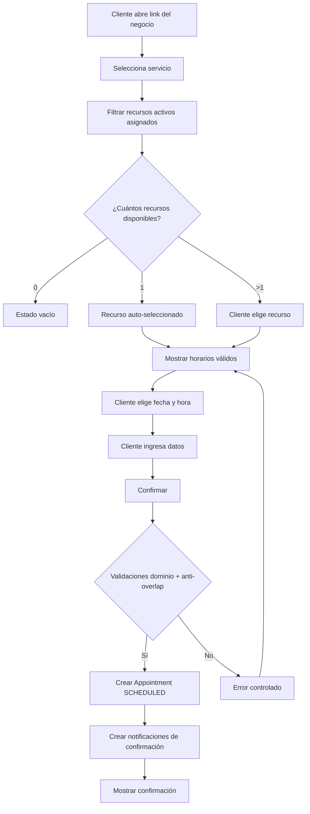

# Flujos principales

Este documento describe los flujos funcionales clave del producto, cubriendo tanto la experiencia del cliente como la operación diaria del negocio.

---

## Flujo 1 — Onboarding del negocio

**Admin**

1. Registrarse / Login (Supabase Auth)
2. Seleccionar país de cuenta y, cuando aplique, zona horaria de cuenta (irreversible)
3. Crear negocio (nombre, resource_label). La timezone se hereda de la cuenta.
4. Configurar parámetros iniciales del negocio:
    - anticipación mínima para reservas
    - recordatorios (on/off y offsets)
    - canales de notificación (email / WhatsApp)

5. El dashboard muestra un checklist inicial:
    - recursos
    - servicios
    - asignar servicios ↔ recursos
    - disponibilidad

6. Completar el checklist

**Resultado:** negocio listo para publicar y gestionar turnos.

---

## Flujo 2 — Crear y gestionar recursos

**Admin**

1. Ir a “Recursos”
2. Crear recurso (nombre, tipo opcional, estado `ACTIVE`)
3. Editar o desactivar recursos según necesidad
4. Eliminar recurso (soft delete) solo si no tiene turnos futuros

**Resultado:** recursos disponibles para ser asignados a servicios.

---

## Flujo 3 — Crear y gestionar servicios

**Admin**

1. Ir a “Servicios”
2. Crear servicio definiendo:
    - duración del turno
    - periodicidad de turnos (por defecto igual a la duración)
    - Tiempo mínimo de anticipación
    - precio opcional

3. Guardar servicio

Gestión posterior:

- Desactivar servicio: deja de ofrecerse públicamente
- Eliminar servicio (soft delete): solo permitido si no existen turnos futuros

**Resultado:** servicios listos para ser ofrecidos y administrados.

---

## Flujo 4 — Asignar servicios a recursos (Service ↔ Resource)

**Admin**

1. Ir a “Servicios”
2. Abrir un servicio → sección “Recursos”
3. Seleccionar qué recursos ofrecen ese servicio (solo recursos `ACTIVE`)
4. Guardar cambios

**Resultado:** el servicio queda reservable con los recursos seleccionados.

> Regla:
> Un servicio `ACTIVE` sin recursos asignados no permite avanzar a la reserva pública.

---

## Flujo 5 — Definir disponibilidad y bloqueos por recurso

**Admin**

1. Entrar a un recurso → “Disponibilidad”
2. Definir rangos semanales por día
3. Guardar cambios
4. (Opcional) Crear bloqueos puntuales (feriados, licencias, mantenimiento)

**Resultado:** el sistema puede calcular horarios disponibles reales para ese recurso.

---

## Flujo 6 — Reserva de turno (cliente)

**Cliente**

1. Abrir el link público `/b/{slug}`
2. Ver la lista de servicios `ACTIVE`
3. Elegir un servicio
4. Elegir recurso (si aplica), filtrado por recursos `ACTIVE` asignados al servicio:
    - Si hay 1 recurso: auto-selección
    - Si hay más de uno: se muestra listado usando `resource_label`

5. Ver horarios disponibles para `(service, resource)`:
    - dentro de la disponibilidad semanal
    - excluyendo bloqueos puntuales
    - excluyendo turnos existentes
    - respetando duración y periodicidad del servicio
    - respetando la anticipación mínima del negocio

6. Elegir fecha y hora
7. Completar datos (nombre + email o teléfono)
8. Confirmar reserva

**Sistema**

- Valida servicio y recurso `ACTIVE`
- Valida relación Service ↔ Resource
- Valida anticipación mínima
- Crea o reutiliza el cliente
- Crea un `appointment` en estado `SCHEDULED`
- La DB impide solapamientos (anti double-booking)
- Crea notificaciones de confirmación (email y/o WhatsApp) de forma asincrónica

**Resultado:** turno confirmado sin doble reserva.

---

## Flujo 7 — Creación de turno por el negocio

**Admin / Staff**

1. Entrar a “Agenda”
2. Seleccionar día / semana / mes
3. Elegir recurso y servicio
4. Seleccionar horario válido
5. Crear o asociar cliente
6. Confirmar creación

**Sistema**

- Usa la lógica de dominio para cálculo de slots disponibles
- Respeta disponibilidad y anti-overlap
- **NO aplica anticipación mínima** (ver US-7.3): permite crear turnos en el mismo día
- **NO permite turnos en el pasado**: el horario debe ser futuro
- Crea notificaciones de confirmación para el cliente según configuración del negocio

**Resultado:** turno creado manualmente y visible en agenda.

---

## Flujo 8 — Ver agenda (negocio)

**Admin / Staff**

1. Entrar a “Agenda”
2. Elegir vista: día / semana / mes
3. Navegar en el tiempo (anterior / siguiente)
4. Filtrar por:
    - recurso
    - estado del turno (`SCHEDULED`, `CANCELLED`, `RESCHEDULED`, `COMPLETED`)

5. Ver turnos con estado y detalles

**Resultado:** visión clara y flexible de la operación diaria.

---

## Flujo 9 — Cancelar turno

**Admin / Staff**

1. Abrir un turno `SCHEDULED`
2. Cancelar (motivo opcional)

**Sistema**

- Cambia estado a `CANCELLED`
- Libera el horario
- Envía notificación de cancelación
- Envía notificaciones de cancelación por los canales configurados (email / WhatsApp)

**Resultado:** turno cancelado y cliente notificado.

---

## Flujo 10 — Reprogramar turno

**Admin / Staff**

1. Abrir un turno `SCHEDULED`
2. Reprogramar → elegir nuevo horario válido

**Sistema**

- Crea un nuevo turno con `rescheduled_from_id` o actualiza el existente
- La DB impide solapamientos
- Envía notificación con el nuevo horario
- Envía notificaciones con el nuevo horario por los canales configurados

**Resultado:** turno reprogramado con trazabilidad.

---

## Flujo 11 — Marcar turno como completado

**Admin / Staff**

1. Abrir un turno atendido
2. Marcar como `COMPLETED`

**Sistema**

- Actualiza estado
- No afecta disponibilidad

**Resultado:** control básico de atención realizada.

---

## Flujo 12 — Recordatorios automáticos (job)

**Sistema**

1. Job periódico
2. Busca turnos `SCHEDULED` próximos según configuración del negocio
3. Crea notificaciones pendientes si no existían (idempotencia)
4. Envía notificaciones por email y WhatsApp según configuración y registra estado

**Resultado:** recordatorios enviados sin duplicados.

---

## Diagrama — Reserva de turno (cliente)

